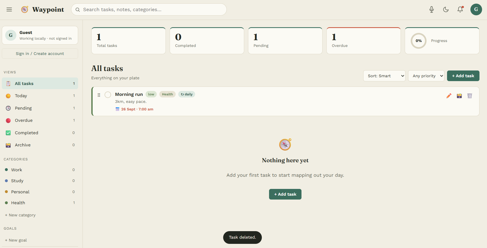

# 🧭 Waypoint — Smart To-Do App

Waypoint is a responsive to-do app built with **HTML, CSS, and JavaScript**. It helps users organize everyday tasks with priorities, reminders, goals, categories, and more.

## Features

* Add, edit, delete and complete tasks
* Tasks with priorities, due dates and categories
* Subtasks and recurring tasks
* Goals and progress tracking
* Search and task filters
* Drag-and-drop task ordering
* Dark and light mode
* Browser reminders and notifications
* Voice task creation
* Smart task breakdown suggestions
* Import and export tasks as JSON
* Local storage for offline use
* Firebase Authentication and Firestore for cloud sync

## Tech Used

* HTML5
* CSS3
* JavaScript
* Firebase Authentication
* Firebase Firestore
* Browser Web APIs

## Run Locally

git clone https://github.com/RiteshRaghav04/waypoint-smart-todo
cd YOUR-REPOSITORY

Open the folder in VS Code and run `index.html` using **Live Server**.

## Live Demo

👉 **[Open Waypoint](https://waypoint-todo.web.app/)**

## Screenshots

## Screenshots

## Project Structure

waypoint-smart-todo/
├── index.html
├── css/
│   └── style.css
├── js/
│   ├── app.js
│   └── firebase-config.js
└── README.md

Built as a web development project.

